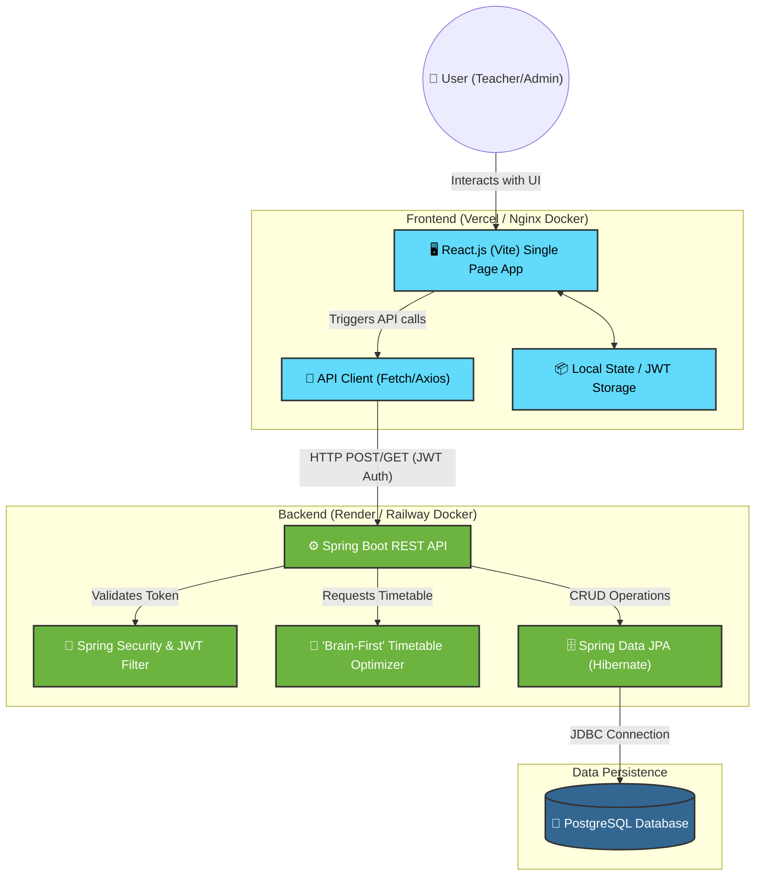

# ScheduleFlow Architecture Diagram

Take a screenshot of the diagram below and upload it to the form.

```mermaid
graph TD
    %% Define Styles
    classDef frontend fill:#61DAFB,stroke:#333,stroke-width:2px,color:#000;
    classDef backend fill:#6DB33F,stroke:#333,stroke-width:2px,color:#fff;
    classDef database fill:#336791,stroke:#333,stroke-width:2px,color:#fff;
    classDef external fill:#f9f9f9,stroke:#333,stroke-width:2px,stroke-dasharray: 5 5;

    %% Nodes
    User(("👤 User (Teacher/Admin)"))
    
    subgraph Frontend ["Frontend (Vercel / Nginx Docker)"]
        React["🖥️ React.js (Vite) Single Page App"]:::frontend
        API_Client["🔌 API Client (Fetch/Axios)"]:::frontend
        State["📦 Local State / JWT Storage"]:::frontend
    end
    
    subgraph Backend ["Backend (Render / Railway Docker)"]
        SpringBoot["⚙️ Spring Boot REST API"]:::backend
        Security["🔐 Spring Security & JWT Filter"]:::backend
        Scheduler["🧠 'Brain-First' Timetable Optimizer"]:::backend
        ORM["🗄️ Spring Data JPA (Hibernate)"]:::backend
    end
    
    subgraph Database ["Data Persistence"]
        Postgres[("🐘 PostgreSQL Database")]:::database
    end
    
    %% Relationships
    User -- "Interacts with UI" --> React
    React -- "Triggers API calls" --> API_Client
    React <--> State
    
    API_Client -- "HTTP POST/GET (JWT Auth)" --> SpringBoot
    
    SpringBoot -- "Validates Token" --> Security
    SpringBoot -- "Requests Timetable" --> Scheduler
    SpringBoot -- "CRUD Operations" --> ORM
    
    ORM -- "JDBC Connection" --> Postgres

```
